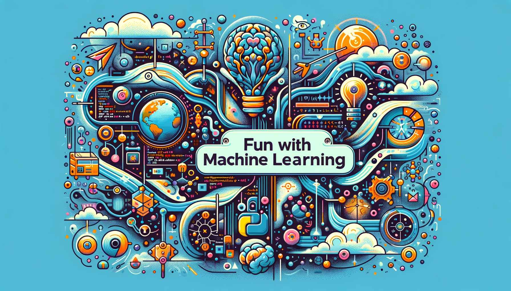

# FUN WITH MACHINE LEARNING

## The Mission Statement
This is a repo where I publish some interesting and fun exercises and projects that explore and showcase machine learning. 

## Contents
- ML at Different Levels

    I write the exact same Neural Network architecture, training, backprop and testing using several libraries and techniques going from the easiest level to the most difficult.

## Contact

You can connect with me on [Linkedin](https://www.linkedin.com/in/kemalata/)

